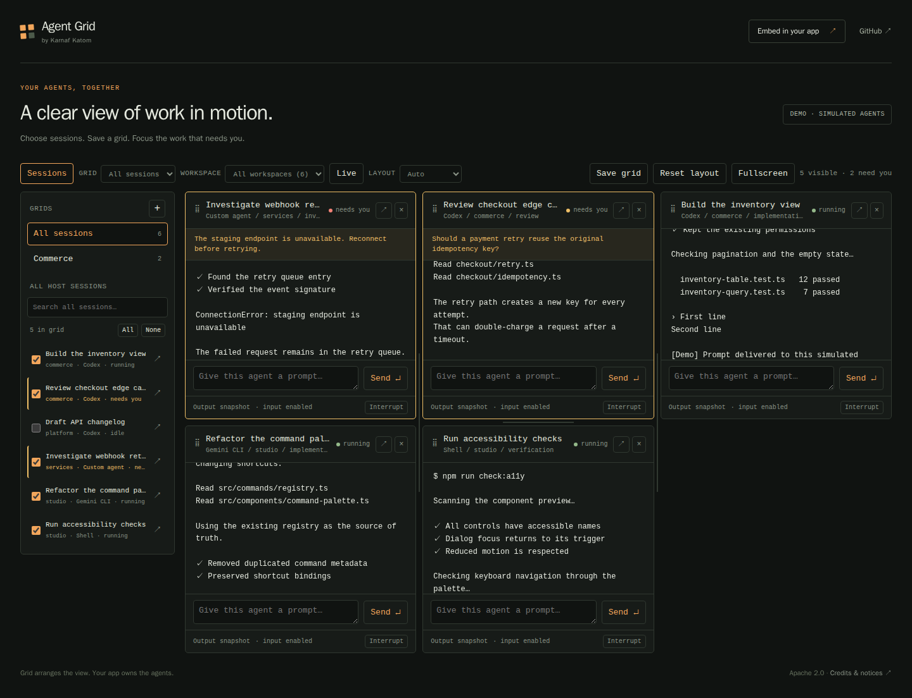

# Agent Grid

**Your agents, together.** A standalone local app and an embeddable grid for agent sessions, by **Karnaf Katom / [Karnaf0katom](https://github.com/Karnaf0katom)**.

Grid arranges the view. Your app owns the agents.



Use it to see which sessions need attention, focus an agent, send a manual prompt, and keep the other sessions in view. Developers supply an adapter for their existing runtime; Grid never needs to replace that runtime.

The sidebar lists every host session, including idle sessions. Search by title, tool, or workspace, then check the sessions you want in view. **Save grid** gives that selection a name. Switch grids in the sidebar or top toolbar; each remembers its own filters, order, column count, and pane sizes. You can collapse the sidebar or use fullscreen when you need more space.

## Run the app

Requires Node.js 20 or newer. The demo has no runtime dependencies, API keys, provider accounts, or build step.

```sh
git clone https://github.com/Karnaf0katom/agent-grid.git
cd agent-grid
npm start
```

Open **http://127.0.0.1:4173**. Demo agents are explicitly labelled as simulated. Sending a demo prompt changes only its in-memory session.

For your real tmux sessions:

```sh
node apps/agent-grid/server.js --tmux
```

This is read-only. To allow manual prompts and current-turn interrupts:

```sh
node apps/agent-grid/server.js --tmux --allow-input --session-prefix my-project
```

The server binds to loopback, validates the request origin, and enforces permissions on the server. Existing sessions retain their commands, working directories, instruction files, and provider authentication. Grid does not launch agents or change repository rules.

## Embed the grid

Install the SDK archive attached to the GitHub release:

```sh
npm install https://github.com/Karnaf0katom/agent-grid/releases/download/v0.2.0/karnafkatom-agent-grid-0.2.0.tgz
```

Or install the library from a local clone:

```sh
npm install ./packages/agent-grid
```

```js
import { mountAgentGrid } from '@karnafkatom/agent-grid/element';
import { createHttpAdapter } from '@karnafkatom/agent-grid';

const grid = mountAgentGrid(document.querySelector('#agents'), {
  adapter: createHttpAdapter({ baseUrl: '/agent-control' }),
  storageKey: 'my-app-agents',
});

// On application teardown:
// grid.destroy();
```

Your host provides the [adapter contract](docs/integrating.md). The component is browser-native and works with plain JavaScript, React, Vue, or any host that can mount a DOM element. TypeScript declarations are included. You can also supply your own terminal or chat renderer with `mountSession()`.

## Included in v0.2

- Searchable session sidebar with individual inclusion controls and quick focus.
- Named saved grids with independent selection, filters, order, and pane sizes.
- Top toolbar with grid switching, automatic or 1–4 column layouts, and fullscreen.
- Attention ordering, workspace filters, live/all toggle, hide/restore, and focused view.
- Pointer and keyboard reordering; adjustable rows and columns; saved order and sizes.
- Per-session multiline composers, manual input, and confirmed current-turn interrupt.
- Explicit host capabilities and read-only mode; loading, empty, and error states.
- A dependency-free demo, HTTP adapter, memory adapter, and tmux adapter.
- A custom renderer seam that preserves mounted panes and cleans up on removal.

Saved grids keep their selected session IDs when a host temporarily stops listing a session, so it returns to the same grid when available again. Switching grids preserves prompt drafts and mounted renderers. Existing v0.1 layouts migrate automatically. Saved grids live in this browser and are scoped to the host's `storageKey`.

The built-in output view polls **text snapshots**. It is suitable for monitoring output and sending prompts; it is not a full PTY terminal emulator. Apps that need terminal keystrokes, ANSI rendering, or terminal resizing should mount their existing terminal renderer. In tmux mode, session status can be supplied by tmux options; inferred process status does not detect an agent's reasoning state.

## Integrating with CCC

[Claude Command Center](https://github.com/amirfish1/claude-command-center) can use Grid as an optional presentation component. CCC keeps its session management, rules, permissions, and project license. The [CCC adoption guide](docs/ccc-adoption.md) proposes a small integration with no backend rewrite or dependency installation.

## Development

```sh
npm test

# Browser verification and screenshots:
npm install
npx playwright install chromium
npm run test:browser
```

The tmux smoke test creates its own socket and session and closes only that session. It never attaches to your real tmux server. Browser tests use simulated sessions.

## License and credit

New code is **Apache 2.0**. Commercial use, paid products, modification, and integration with proprietary apps are permitted. Keep the license and required notices. Grid does not impose its license on the rest of an app or give its author ownership of that app. A public UI watermark is not required.

See [LICENSE](../../packages/agent-grid/LICENSE), [NOTICE](../../packages/agent-grid/NOTICE), [third-party notices](../../packages/agent-grid/THIRD_PARTY_NOTICES.md), and the [license guide](docs/licensing.md). Layout and ordering logic originated in Agent Deck's Fleet Grid; its MIT notice is preserved.
